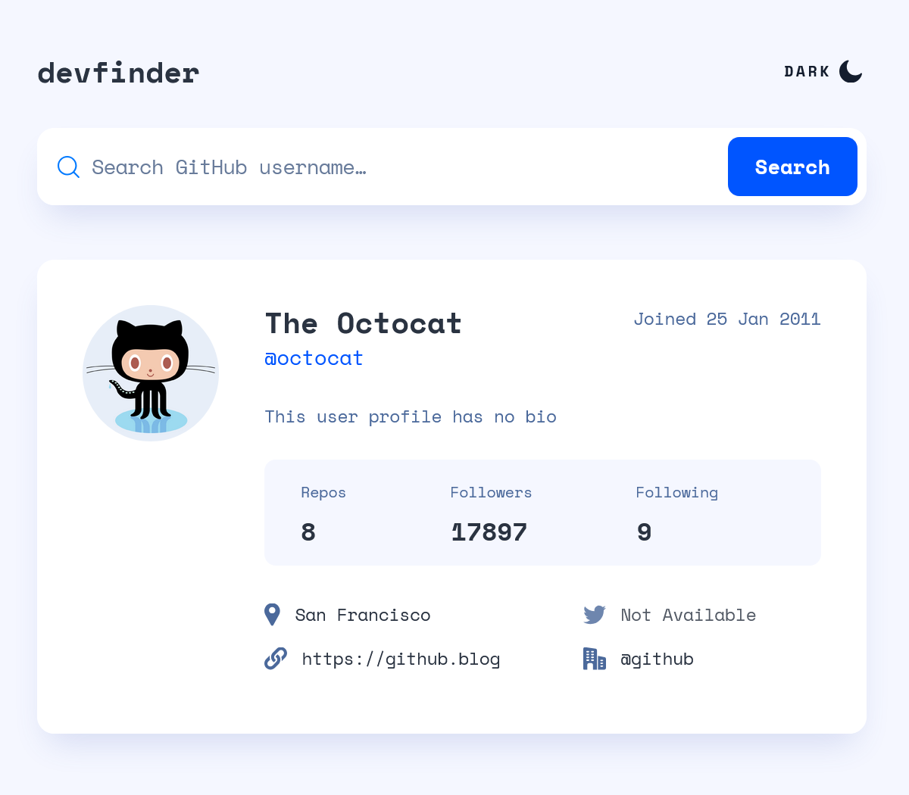

# Frontend Mentor - GitHub user search app solution

This is a solution to the [GitHub user search app challenge on Frontend Mentor](https://www.frontendmentor.io/challenges/github-user-search-app-Q09YOgaH6). Frontend Mentor challenges help you improve your coding skills by building realistic projects.

## Table of contents

- [Overview](#overview)
  - [The challenge](#the-challenge)
  - [Screenshot](#screenshot)
  - [Links](#links)
- [My process](#my-process)
  - [Built with](#built-with)
  - [Additional project notes](#additional-project-notes)
  - [What I learned](#what-i-learned)
  - [Useful resources](#useful-resources)
- [Author](#author)
- [Acknowledgments](#acknowledgments)

## Overview

### The challenge

Users should be able to:

- View the optimal layout for the app depending on their device's screen size
- See hover states for all interactive elements on the page
- Search for GitHub users by their username
- See relevant user information based on their search
- Switch between light and dark themes
- **Bonus**: Have the correct color scheme chosen for them based on their computer preferences.

### Screenshot




### Links

- [FEM Solution URL](https://www.frontendmentor.io/solutions/responsive-web-app-using-css-grid-and-javascript-n8fk2Schxv)
- [Live Site UR](https://vocal-yeot-39a256.netlify.app/)

## My process

### Built with

- Semantic HTML5 markup
- CSS custom properties
- Flexbox
- CSS Grid
- Mobile-first workflow
- Vanilla JavaScript

### Additional project notes

To improve the accessibility of the web app, I diverged from the design comp in these areas:

- Slight update to base colors to achieve better contrast ratios
- Minor font size adjustments for better readability
- Repositioned the alert dialogs for improved A11Y compliance

### What I learned

I initially marked up and styled the GitHub User's metadata section using grid and a series of divs before realizing this small section felt like tabular data and a good use case for a `table` element. It's a small thing here, but it seemed like a good opportunity to brush up on marking up a table, which I've rarely had to do outside of a tutorial.

```html
<table class="gh-info__table">
  <caption class="visually-hidden">
    Count of User's total repos, followers, and Github users followed
  </caption>
  <thead>
    <tr>
      <th scope="col" class="gh-info__table-header">Repos</th>
      <th scope="col" class="gh-info__table-header">Followers</th>
      <th scope="col" class="gh-info__table-header">Following</th>
    </tr>
  </thead>
  <tbody>
    <tr>
      <td id="gh-user__repos" class="gh-info__table-item">8</td>
      <td id="gh-user__followers" class="gh-info__table-item">
        3938
      </td>
      <td id="gh-user__following" class="gh-info__table-item">9</td>
    </tr>
  </tbody>
</table>
```

Styling to match the design comp was easier by simply changing the table's display to grid, but I decided the convenience wasn't enough to justify losing the table's native semantics. Overall, these felt like some pretty modest styles to get the job done.

```css
.gh-info__table {
  table-layout: fixed;
  width: 100%;
  border-collapse: collapse;
  border-radius: var(--radius-100);
  background: var(--clr-offwhite);
}

.gh-info__table th {
  padding-block-start: var(--spacing-125);
  padding-inline: 0;
  font-size: var(--fs-200);
  font-weight: 400;
}

.gh-info__table th:first-of-type,
.gh-info__table td:first-of-type {
  padding-inline-start: var(--spacing-075);
}

.gh-info__table th:last-of-type,
.gh-info__table td:last-of-type {
  padding-inline-end: var(--spacing-075);
}

.gh-info__table td {
  padding-block: var(--spacing-075) var(--spacing-125);
  text-align: center;
  font-size: var(--fs-600);
  font-weight: 700;
  line-height: 1.1;
  color: var(--clr-lm-dark);
}
```

For the JavaScript components of the app, I set out to make each function as specific in purpose as possible, which helped me keep the code understandable as I went and hopefully more readable to others. The `renderUserTwitter` function was a bit more involved than the other rendering functions, mainly because of how I organized the HTML, but is a good example of how most of the others are written.

```js
function renderUserTwitter(twitter_username) {
  const userTwitter = document.getElementById('gh-user__twitter');
  if (userTwitter.childNodes.length > 0) {
    userTwitter.innerHTML = ''; // clear previous <a> tag if one exists
  }
  if (!twitter_username) {
    userTwitter.textContent = 'Not Available'; // add text content to <span> tag
  } else {
    const twitterLink = createAnchorElement(`https://twitter.com/${twitter_username}`, twitter_username); // create <a> tag with href and text content
    userTwitter.appendChild(twitterLink); // append <a> tag to <span> tag
  }
  // set opacity for <li> tag
  userTwitter.parentElement.style.opacity = twitter_username ? '1' : '0.8'; 
}
```

### Useful resources

- [web.dev](https://web.dev/articles/building/a-theme-switch-component) - I leaned heavily into Adam Argyle's approach to handling the light-dark theme switch component of this app. Much of my resulting code draws directly from his solution, with some slight tweaking to align better with this project's particular challenge.
- [Beautiful focus outlines](https://medienbaecker.com/articles/focus-outlines) - Great article on creating good-looking and accessible focus outlines for interactive elements. Tried some of the approaches in this project.

## Author

- Website - [Matt Pahuta](https://www.mattpahuta.com)
- Frontend Mentor - [@mattpahuta](https://www.frontendmentor.io/profile/MattPahuta)
- Bluesky - [@mattpahuta](https://bsky.app/profile/mattpahuta.bsky.social)
- LinkedIn - [Matt Pahuta](www.linkedin.com/in/mattpahuta)

## Acknowledgments

I'd like to recognize the folks at [Skillcrush](https://skillcrush.com/), where much of my early web development learning journey began. One of the final projects in their JavaScript course is a similar GitHub Repo Gallery project that uses the GitHub API to dynamically search and populate content. It was a fantastic primer for this Frontend Mentor challenge.
